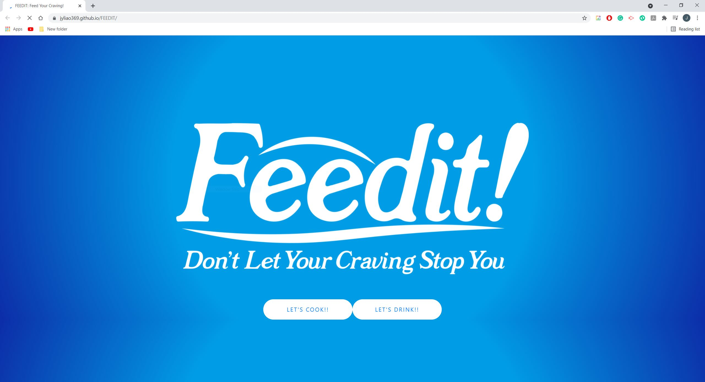
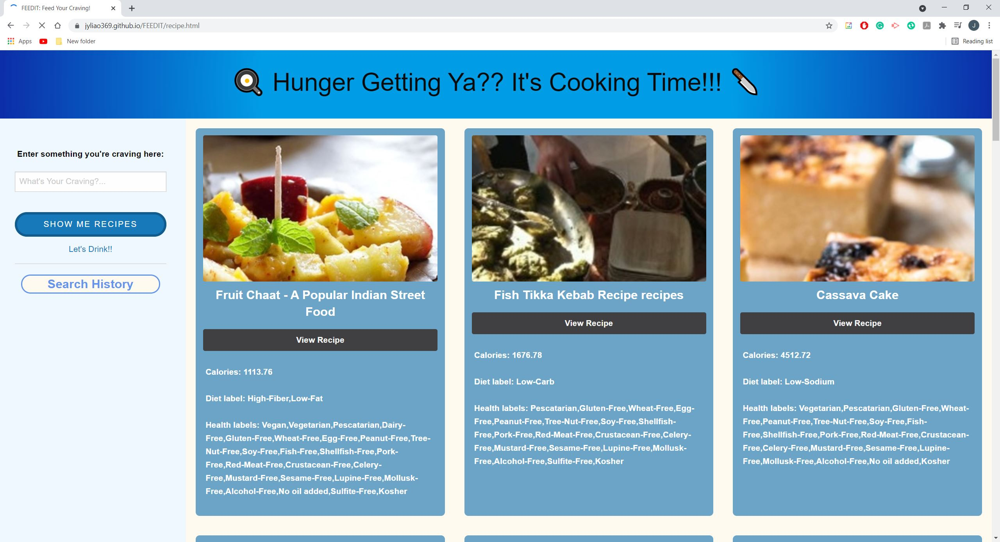
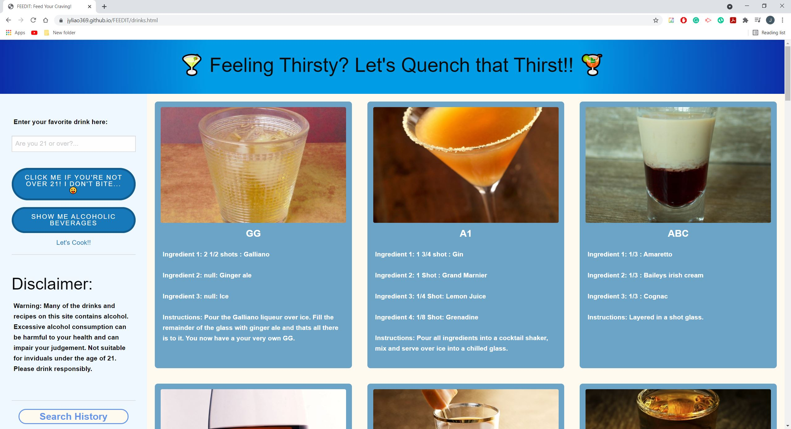
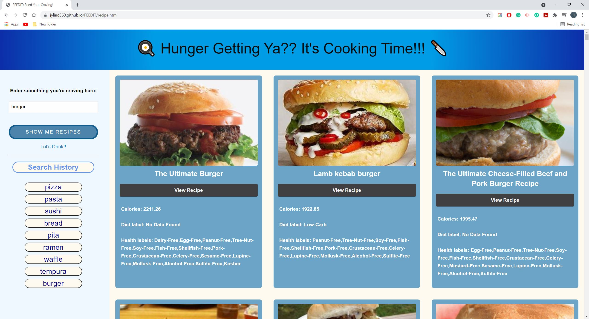

# FEEDIT!

Have a craving for something to eat? Feed it! Feedit is an application for a user to find options to help with their mid-day food cravings. It allows a user to select a catagory of food they're craving and be presented with both local takeout options as well as recipes to give them a chance at making their favorite dishes at home! The app can not only give you ingredients and directions you need to make your favorite foods, but can also let you know ahead of time if you're feeling lazy, if the restarant you're craving offers delivery!

### Technologies
* Javascript
* CSS
* Bootstrap
* APIs (Edamam and cocktaildb)
* Localstorage
* Jquery
* Client-Side storage
* Foundation CSS
* Vendor Javascript

### Screenshots
--Main Page--

--Recipes Page--

--Drinks Page--

--Application in Action--

### Live Website Link

Live Link to the Github Website Live:
https://jyliao369.github.io/FeedIt/

GitHub Repo:
https://github.com/jyliao369/FeedIt

